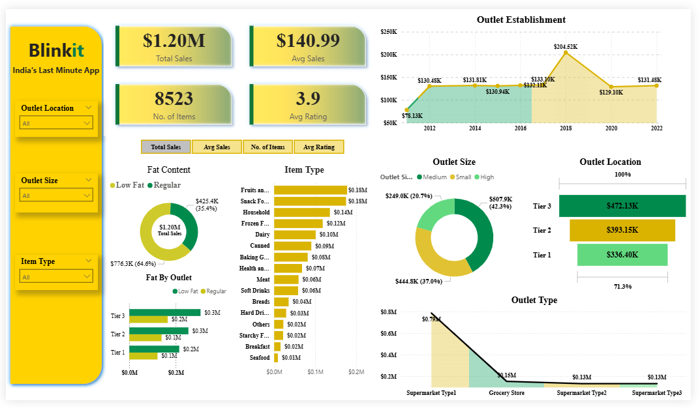

# 🛒 Blinkit Sales Analysis Dashboard (Power BI)

## 📌 Project Overview

This project is a **Power BI dashboard** built using Blinkit grocery data. It provides insights into sales performance, item distribution, outlet characteristics, and customer ratings.

The goal is to practice **data visualization, KPI tracking, and business insights generation** using Power BI.

---

## 📊 Dashboard Preview

---

## 📁 Project Files

* `Blinkit_PowerBI.pbix` → Power BI report file
* `BlinkIT Grocery Data.xlsx` → Dataset used for analysis
* `background kpi.png` → Background design for KPI cards
* `DashBoard.png` → Dashboard preview image

---

## 📈 Key Metrics (KPIs)

* 💰 **Total Sales**: $1.20M
* 📊 **Average Sales**: $140.99
* 📦 **Number of Items**: 8523
* ⭐ **Average Rating**: 3.9

---

## 🔍 Insights from Dashboard

---

## 🛠️ Tools & Technologies Used

* **Power BI** (Data Visualization)
* **Excel** (Data Source)
* **DAX** (Measures & Calculations)

---

## 🎯 Learning Outcomes

* Built interactive dashboards using Power BI
* Learned data cleaning and transformation
* Created KPIs using DAX
* Designed visually appealing reports

---

## 🙌 Acknowledgment

This project is part of my **Power BI learning journey** to strengthen my data analytics and visualization skills.

---
